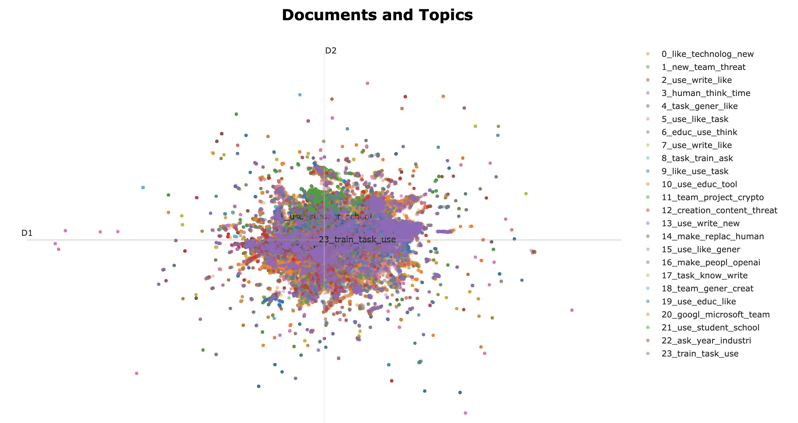
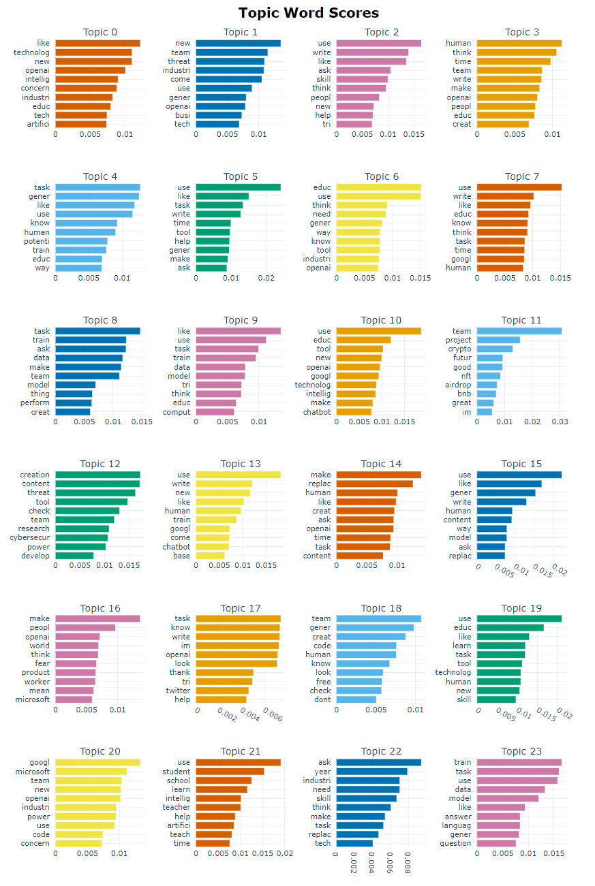
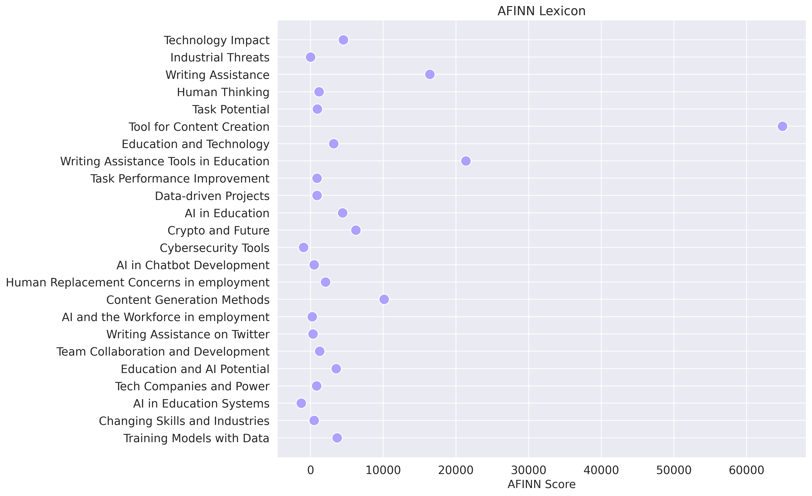
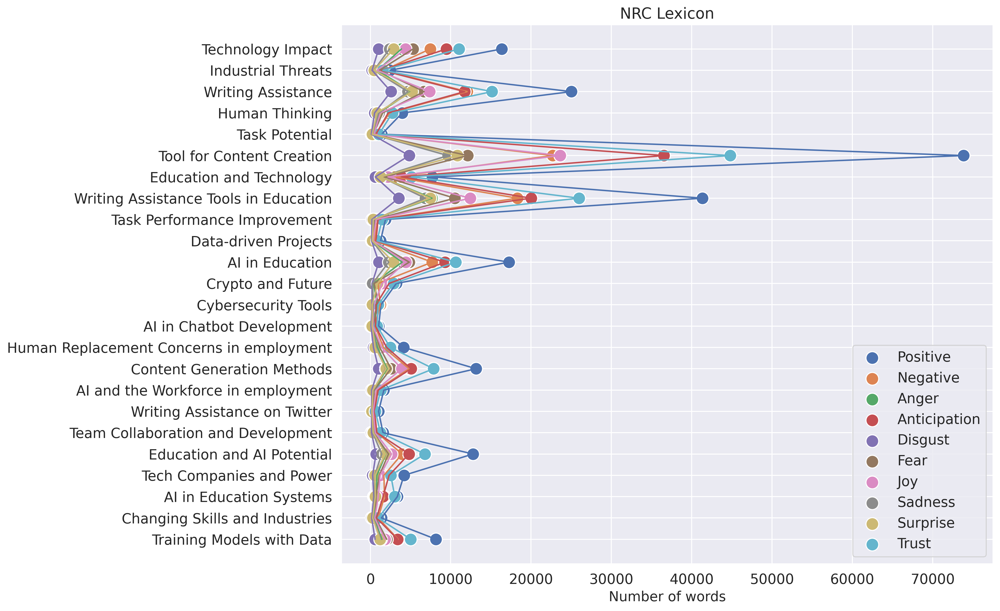
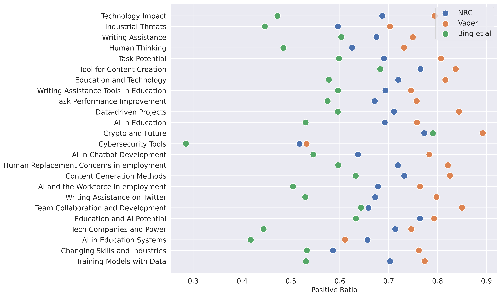

# <BitermTopicModel-ChatGPTAnalysis>

## Description

The appearance of ChatGPT has caused a global craze, and people are discussing the impact of ChatGPT on human life and production. Our project adopts the BitermTopicModel to carry out topic analysis on the content about ChatGPT on Twitter, and analyzes the topic of each tweet and the specific topic content. Finally find out what people are talking about ChatGPT.

The reason why BitermTopicModel is used is that Twitter data is usually some short text with weak context, and this model can better complete the task of short text analysis.

## Table of Contents

- [Installation](#installation)
- [Folder Structure](#folderstructure)
- [Usage](#usage)

## Installation

**Step 0.** Install BTM
```
pip install biterm
```

or install the biterm of the modifed version from my own repo, then you can skip Step 1.

```
pip install git+https://github.com/xizero00/biterm.git
```

**Step 1.** Modify the code in the package
 
You should replace the `btm.py` and `utility.py` in the BTM package with the two files we provided in `replace_file`

Then you have completed the installation steps

## FolderStructure
```
BitermTopicModel-ChatGPT/
│
├── analysis/
│   ├── data/ sentiment lexicon data
│   │   ├── opinion-lexicon-English/ - This folder contains bing etal sentiment lexicon
│   │   │   └── ...
│   │   └── NRC-Emotion-Lexicon-v0.92-In105Languages-Nov2017Translations - NRC sentiment lexicon
│   │
│   ├── result/ - This folder contains only excel sheet files
│   │   ├── BTM_excel/ - This folder contains excel table of analysis results for topics
│   │   │   └── ...
│   │   └── sentiment_metrics_excel/ - This folder contains excel table of analysis results for sentiment
│   │       └── ...
│   │
│   └── vis/ - This folder only contains visualizations
│       ├── num_topics_metrics/ - This folder contains visualizations of the various metrics used to select the number of topics
│       │   └── ...
│       ├── result/ - This folder contains a visualization of the number of tweets per topic
│       │   └── ...
│       ├── sentiment_metrics/ - This folder contains visualizations of the various metrics used to sentiment analysis
│       │   └── ...
│       └── topics_vis/ - This folder contains visualizations of the topic_word_scores and documents_and_topics
│           └── ...
│
├── data/ - This folder contains dataset
│   ├── 2023-05-17-15-30-06_after_preprocess_dataset_clean_english_only_new.csv - data after preprocessing
│   ├── 2023-05-17-15-30-06_after_preprocess_dataset_clean_english_only_new.txt - Another file format
│   ├── dataset_clean_english_only_new.csv - original data
│   ├── dataset_clean_english_only_new.txt - Another file format
│   └── dataset_clean_english_only_new.xlsx - Another file format
│
├── log/ - This folder contains the log files that record the selection of the number of subjects and the training process
│   └── ...
│
├── models/ - This folder stores the model weights files
│   ├── btm_model_2023-06-13-20-46-08_5iter_24t.pkl - Model weight file for 5 iteration
│   └── btm_topics_2023-06-13-20-46-08_5iter_24t.pkl - Topic probability distribution file for 5 iteration
│
├── output/ - This folder stores the output of model
│   ├── topic_coherence_result_2023-06-13-20-46-08_5iter_24t.txt - topic-word probability distribution for 5 iteration 
│   ├── topic_result_2023-06-13-20-46-08_5iter_24t.txt - The results of the topic assigned by each document for 5 iteration
│
├── replace_file/
│   ├── btm.py - replace the same file in btm package
│   └── utility.py - replace the same file in btm package
│
├── utils/
│   ├── convert_data_file.py - Convert file formats
│   └── logger.py - used to print log files
│
├── vis/ - visual results in html format 
│   └── online_btm_2023-06-13-20-46-08_5iter_24t.html - html result for 5 iteration
│
├── 01_dataprocessing.py - data preprocessing code
│
├── 02_btm_find_topcs_num.py - the number of topics selected code
│
├── 02_vis_find_topics_num.py - Visual code for the number of topics selected metric
│
├── 03_btm_trian.py - training code
│
├── 04_table_generate_result.py - analysis of btm generation results are stored in ./analysis/result/BTM_excel/
│
├── 05_btm_analysis_result.py - visualization of btm generation results
│
└── 06_sentiment_analysis.py - an emotional analysis of Twitter texts
```


## Usage

If you want to train the BTM model against your data set and analyze and visualize the results of the BTM model, the following changes are required

Firstly, you should use `01_dataprocessing.py` to preprocess your corpus.

Then, You should modify the code `btm = oBTM(num_topics=20, V=vocab)` in `03_btm_train.py`, the total number of topics can be determined by yourself or obtained by searching in `02_btm_find_topics_num.py` and `02_vis_find_topics_num.py`. In `btm.fit(biterms_chunk, iterations=iteration_num)`, you can specify the number of iterations of model training. Each iteration updates the entire corpus topic.

After the results are obtained, you can use `04_table_generate_result.py` to generate excel table, and use `05_btm_analysis_result.py` to generate following visual results.



You can use `06_sentiment_analysis.py` to acquire the results of sentiment analysis, the visualization is as follows: 



 
 

